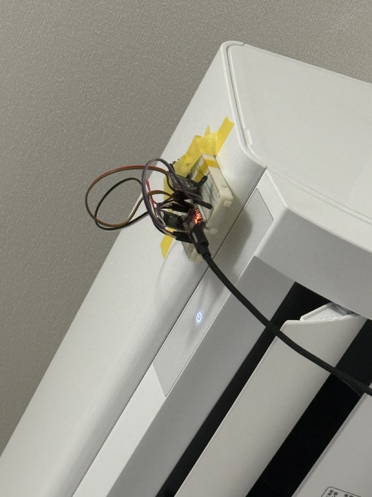
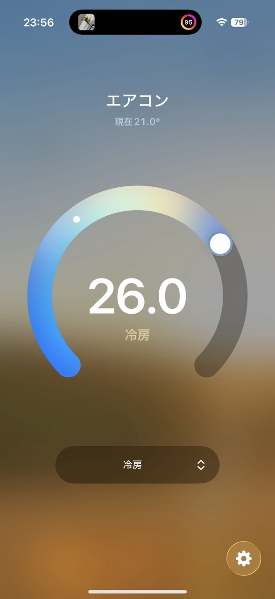
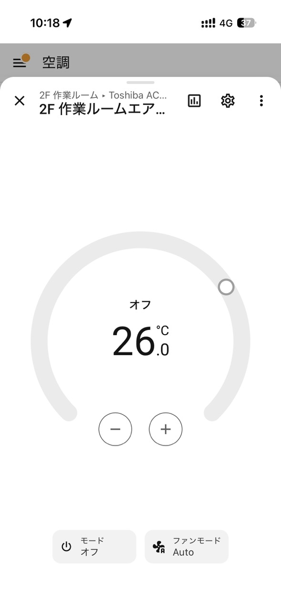
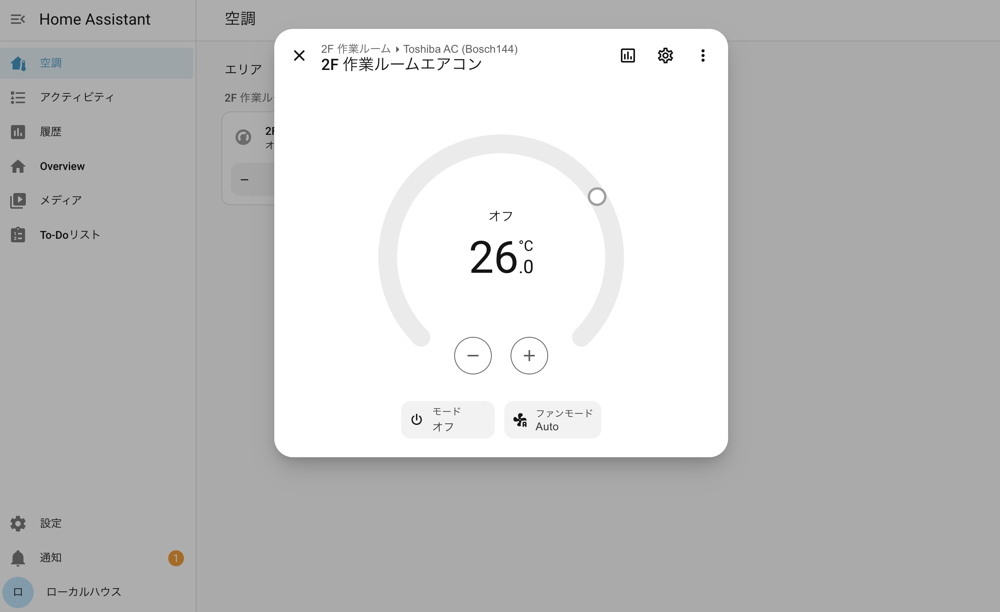
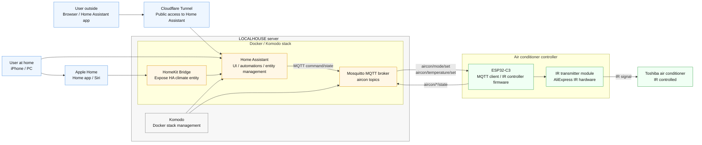

| Circuit | Apple Home | Home Assistant | Web |
| ---|---|---|---|
|  |  |  |  |

ESP32-C3 で東芝風エアコン（リモコン **RG10J5(B3H)/BGJ**、実体は **Bosch144** プロトコル）を
Web / Home Assistant / Apple Home / 物理リモコン から操作・相互同期する。

## 構成

| ファイル | 役割 |
|---------|------|
| `src/main.cpp` | WiFi / Web UI / 状態同期 |
| `src/AcIr.{h,cpp}` | IR 送信(RMT 38kHz) + 受信デコード |
| `src/AcMqtt.{h,cpp}` | Home Assistant 連携 (MQTT Climate 自動検出) |
| `src/secrets.h` | WiFi / MQTT 認証情報（gitignore） |

## 配線

| 部品 | ピン |
|------|------|
| IR LED（送信、トランジスタ駆動推奨） | GPIO4 |
| IR 受信モジュール OUT（VS1838B 等） | GPIO5 |
| VCC / GND | 5V / GND |

## セットアップ

```sh
cp src/secrets.example.h src/secrets.h   # WiFi と MQTT を記入
pio run -t upload
pio device monitor                        # IP を確認
```

`http://toshiba-ac.local/` または表示された IP にアクセス。電源/モード/温度(16〜30℃,0.5刻み)/風量を操作。

## Home Assistant / Apple Home

ESP が MQTT discovery を publish → HA が `climate.*` を自動生成。Apple Home へは HA の **HomeKit Bridge** で公開。

1. ブローカー(Mosquitto)にユーザ作成 → `secrets.h` の `MQTT_HOST/PORT/USER/PASS` に記入。`MQTT_HOST` は `.local`(mDNS) でも IP でも可。
2. HA → Devices & Services → MQTT 統合を追加（discovery 有効）。
3. HA → HomeKit を追加し `climate` を include → iOS「ホーム」でコードをスキャン。

トピック: `aircon/set`(cmd) / `aircon/state` / `aircon/availability`(LWT) / `homeassistant/climate/aircon/config`(discovery)。
Apple Home は cool/heat/auto/off のみ（dry/fan_only/風量は HA/Web から）。ブローカーは ESP と同一ネットワークに置く。

## メモ（実装上の要点）

- 送信は **RMT ハードウェアキャリア必須**（C3 のソフト digitalWrite だと 38kHz が歪む）。
- ベンダーバイトは実機 **0xC2**（ライブラリ既定 0xB2）。section1/2 の byte0/6 のみ差替え、**section3(byte12) は触らない**。
- 温度 0.5℃ は半度ビット `TempS4`(byte14 bit5)。電源 OFF は別プロトコル **Coolix `0xC27BE0`**。
- 送信後 500ms は自己受信をミュート（至近の自己受信は化けるため）。
- 新リモコン解析: `pio run -e capture -t upload` で Protocol/state hex をダンプ。


---

# Home Assistant Architecture



## Notes

- Home Assistant is exposed externally through Cloudflare Tunnel.
- Komodo runs on the LOCALHOUSE server and manages the Docker stack.
- Home Assistant, Mosquitto, and HomeKit Bridge run on the LOCALHOUSE server.
- ESP32-C3 receives MQTT commands and sends IR signals through the AliExpress IR module.
- Apple Home works through HomeKit Bridge on the local network.
- Without a HomePod or Apple TV 4K home hub, Apple Home remote control is not available outside the local network.

IR module reference: https://ja.aliexpress.com/item/1005007312108359.html
